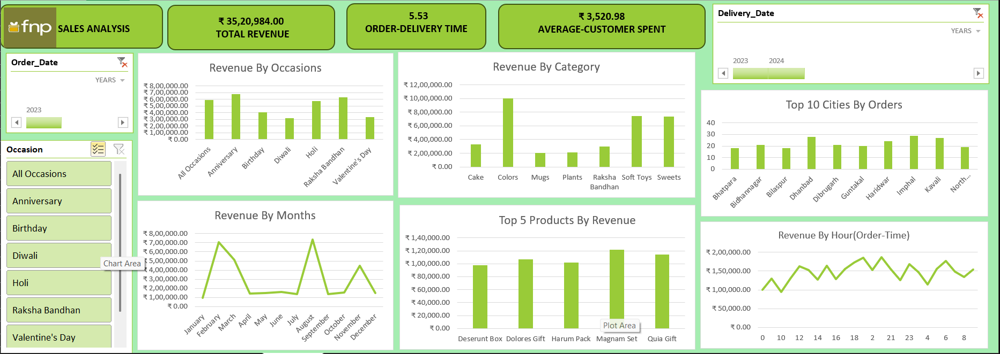

# FNP Sales & Revenue Analysis Dashboard

## Project Overview

An interactive Excel dashboard created to analyze FNP sales and revenue performance. It provides a clear view of sales trends and patterns across products, categories, occasions, cities, and order times.

## Key Analysis

* Revenue by Occasion
* Revenue by Category
* Monthly Revenue Trends
* Top 5 Products by Revenue
* Top 10 Cities by Orders
* Revenue by Hour
* Average Customer Spending
* Average Order-Delivery Time

## Tools & Skills

* Microsoft Excel
* Pivot Tables
* Pivot Charts
* Slicers
* Data Analysis
* Data Visualization

## Dashboard Features

The dashboard uses Pivot Tables, Pivot Charts, and Slicers to make the sales data interactive and easy to analyze.

## Project Objective

The objective of this project is to transform raw sales data into an interactive dashboard that helps understand revenue performance, product trends, customer spending, and order patterns.

## File

**FNP Sales & Revenue Analysis Dashboard.xlsx** – Excel dashboard and analysis file.
